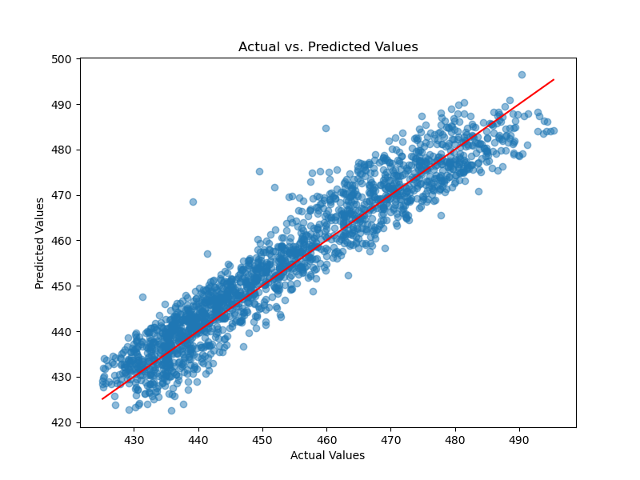

# Power Plant Energy Prediction with Artificial Neural Networks (ANN)

## 📝 Table of Contents
- [Project Overview](#-project-overview)
- [Key Features](#-key-features)
- [Dataset Description](#-dataset-description)
- [Model Architecture](#-model-architecture)
- [Training Parameters](#-training-parameters)
- [Performance Metrics](#-performance-metrics)
- [Installation Guide](#-installation-guide)
- [Usage Instructions](#-usage-instructions)
- [Results Visualization](#-results-visualization)
- [License](#-license)
- [Contact Information](#-contact-information)

## 🌟 Project Overview
This project implements an Artificial Neural Network (ANN) to predict the net hourly electrical energy output (PE) of a combined cycle power plant. The model achieves a **Mean Squared Error (MSE) of 26.86** on the training data, demonstrating strong predictive capability for energy generation forecasting.

## 🚀 Key Features
- Complete data preprocessing pipeline
- ANN implementation with TensorFlow/Keras
- Comprehensive model evaluation
- Visual comparison of actual vs predicted values
- Batch training optimization

## 📊 Dataset Description
**File:** Folds5x2_pp.xlsx (9,568 samples, 5 features)

### Features:
- AT: Ambient Temperature (°C)
- V: Exhaust Vacuum (cm Hg)
- AP: Ambient Pressure (millibar)
- RH: Relative Humidity (%)

### Target Variable:
- PE: Net Hourly Electrical Energy Output (MW)

## 🧠 Model Architecture
```python
ann = tf.keras.models.Sequential()
ann.add(tf.keras.layers.Dense(units=6, activation='relu', input_shape=(X_train.shape[1],)))
ann.add(tf.keras.layers.Dense(units=6, activation='relu'))
ann.add(tf.keras.layers.Dense(units=1))
```
## ⚙️ Training Parameters
### Neural Network Configuration:

| Parameter    | Value  | Description                     |
|--------------|--------|---------------------------------|
| Optimizer    | Adam   | Adaptive Moment Estimation      |
| Loss Function| MSE    | Regression loss metric          |
| Batch Size   | 32     | Samples per weight update       |
| Epochs       | 100    | Full training cycles            |
| Test Size    | 20%    | Holdout for evaluation          |

## 📈 Performance Metrics
### Training Progress

- **Initial Loss:** 125,187.69 (Epoch 1)
- **Final Loss:** 26.86 (Epoch 100)
- **99.79% loss reduction during training**

## 📥 Installation Guide
1. Clone repository:
```bash
git clone https://github.com/barisgudul/ANN-Energy-Prediction.git
cd ANN-Energy-Prediction
```

2. Create virtual environment:
```bash
# Unix/macOS
python -m venv churn_env
source churn_env/bin/activate

# Windows
python -m venv churn_env
churn_env\Scripts\activate
```

## 🖥️ Usage Instructions
1. Place dataset in ANN_for_Power_Plant_Energy\Dataset\Folds5x2_pp
Run Jupyter notebook:
```bash
jupyter notebook main.ipynb
```
2. Execute cells sequentially
3. Check Results/ directory for generated outputs

## 📊 Results Visualization
### Actual vs Predicted Values



**Actual vs Predicted**
---
### Key Observations:

- Tight clustering around diagonal line indicates strong predictive accuracy
- Model maintains performance across different energy output ranges
- Minor variance in higher energy output ranges

## 📄 License

**MIT License**  
[](https://opensource.org/licenses/MIT)

**Permissions:**  
✅ Free academic/research use  
✅ Modification and redistribution  
❌ Commercial use requires written consent  

Full license terms available in [LICENSE](LICENSE) file.

---

## 📧 Contact Information

**Project Maintainer**  
[]()  
[](mailto:mehmetbarisgudul@gmail.com)  
[](https://linkedin.com/in/mehmet-baris-gudul-1101bg)

**Contribution Guidelines:**  
We welcome collaborations! Please reach out via email before submitting PRs.


**Technical Support:**  
For implementation assistance, include "[Power Plant]" in your email subject line.
